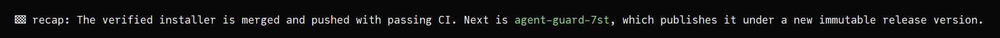

# opencode-recap

A tiny global [OpenCode](https://opencode.ai/) plugin that asks agents to end
substantive replies with a compact, continuity-friendly recap.

## Example

```text
🏁 recap: We're improving session handoffs so the next action stays obvious.
Right now: review the latest change, then continue with the queued work.
```



The recap describes what happened in the current turn and, when useful, the
immediate blocker, decision, or next move. It avoids generic completion receipts
such as `result: done`.

## Install

Install the plugin globally so it applies regardless of the directory from which
OpenCode is launched:

```sh
mkdir -p ~/.config/opencode/plugins
curl -fsSL \
  https://raw.githubusercontent.com/noah/opencode-recap/main/recap-line.js \
  -o ~/.config/opencode/plugins/recap-line.js
```

Quit and restart OpenCode after installation. OpenCode loads plugins when the
process starts, so already-running processes do not pick up file changes.

## Configure

Edit the configuration at the top of
`~/.config/opencode/plugins/recap-line.js`:

```js
const recapConfig = {
  prefix: "🏁",
  maxCharacters: 255,
};
```

- `prefix` controls the character or text shown before `recap:`.
- `maxCharacters` controls the requested maximum length, including the label.

Restart OpenCode after changing either value.

## Update

Run the installation command again to replace the installed plugin with the
latest version, then restart OpenCode.

## Uninstall

```sh
rm ~/.config/opencode/plugins/recap-line.js
```

Restart OpenCode after removing the file.

## How It Works

OpenCode automatically discovers JavaScript and TypeScript plugins under
`~/.config/opencode/plugins/`. This plugin uses
`experimental.chat.system.transform` to append a recap-format instruction to
the system prompt for each request. It does not read conversations, call a
network service, write session data, or modify model output after generation.

Because the hook is experimental, a future OpenCode release may require a
plugin update. The recap is also an instruction rather than deterministic
post-processing, so exact model wording can vary.

## License

[MIT](LICENSE)
